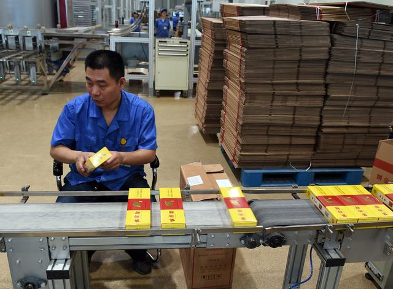
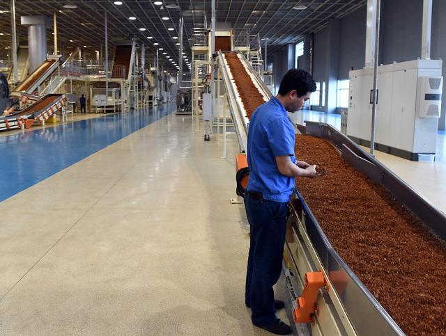
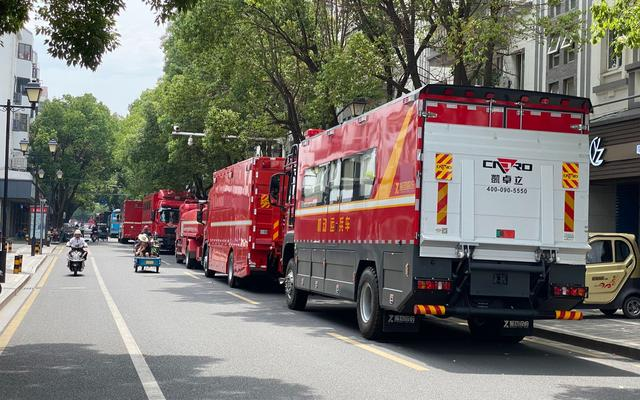

# 百度首页实战

花了一天多时间将百度首页近似的搭建了出来，不过在搭建的过程中发现很多地方他们实现的方法与目前所学到的有很大区别。

比如导航栏在教材中是通过列表来进行实现，但他们是通过div元素来实现的，并且在布局方面设计得结构性更好，一些相似结构的元素就放在一个整体中。


第一次自己独立做练习，很生疏，很多元素的布置都迷茫过很久，经过练习，大致有了一个了解，感觉很多细节部分只能通过练习才能发现，觉得这里面有很多小技巧。

利用开发者模式来不断查看原网站与自己网站的具体情况进行对比，有助于提高完成度。


以下是遇到的一些很重要的知识点：


### 输入框和确认按钮间对齐无间隙


这里输入框和百度一下之间对齐并且没有间隙。

**实现方法：**

将输入框和确认按钮都设为浮动元素，这样他们就会自动贴近并对齐。

```css
#text {
  /* 输入框 */
  /* position: relative; */
  float: left;
  border: 2px solid;
  border-color: #c4c7ce #4e6ef2 #c4c7ce #c4c7ce;
  outline: none;
}


\#baidu {
  /* 确认按钮 */
  cursor: pointer;
  float: left;
}
```

或者将确认按钮设为绝对布置，但是确认按钮会脱离流，所以整体的居中布局会受到影响。

```css
#baidu {
   /* 确认按钮 */
  position: absolute;
  /* float: left; */
  /* display: inline; */
}
```


如上图所示，根据百度的位置可以看出下面只有输入框独立居中了。


#### 对输入框和搜索框的边界问题

如下图所示，因为这里为输入框添加了边框，由于边框的宽度问题导致了拼接不完整。


**解决方法：**

将百度一下的边界margin-left设为-2px即边框宽度，使得百度一下向左平移2px，并设置一个z-index确保可以覆盖住边框。

完成效果：


### 图片与文字中间对齐


类似于上图这种，图片的中间与文字中间对齐。

**实现方式：**

为图片和后面的文本同时应用`vertical-align: middle;`

```css
#headright li {
  float: left;
  margin: 19px 0 0 31px;
  padding-bottom: 20px;
  /* 为图片和文字同时加这个属性使得他们在中间对齐 */
  vertical-align: middle;
  line-height: 19px;
}

#headright img {
  width: 24px;
  height: 24px;
  border-radius: 50%;
  vertical-align: middle;
}
```

这里，通过`border-radius`属性将图片边角进行圆滑处理。


### 列表编号样式化


类似于上图这种，编号序号设为自定义的颜色。

**实现方法：**

1. 先将原本样式取消

```css
#list ul {
  list-style: none;
  padding-left: 35px;
}
```

并将HTML中的列表格式改为

```html
 <li><a href="#"><span class="listindex hot_index1">1</span>新乡一产妇第三胎生下龙凤四胞胎<span class="re">热</span><span class="data"></span></a><span class="data">490万</span></li>
```

通过这种方式添加编号：`<span class="listindex hot_index1">1</span>`

```css
.listindex {
    color: #c4c7ce;
    /* 与标题对齐 */
    margin: 0 1em  0 -1em;
}
```

其中右边距1em是为了与右边的列表内容增加一个间距，左边距-1em是为了将序号调整到正常列表项的位置。

为不同元素设置不同的颜色样式。

<hr>

其中图片中后面的热字是通过将这个字放入一个`<span>`并为其增加内边距，再添加一个背景颜色。

```css
span.re {
  margin-left: 10px;
  padding:2px 2px 2px 2px;
  background-color: orangered;
  text-align: center;
  /* vertical-align: middle; */
  color: white;
  border-radius: 5px;
}
```

<hr>

后面的热度数字部分，通过将列表项设置为相对布置，再将热度的数字部分设置为绝对布置来实现。

```css
#list li {
  position: relative;
}

span.data {
  position: absolute;
  right: 0;
  font-size: 0.9em;
  color:#c4c7ce;
  text-align: right;
}
```


### 在链接下方一定距离的地方添加下划线


类似于上图这种情况，当鼠标指向时，不是在文字下方直接添加而是在距离一定位置处添加。


**做法：**

不再直接使用：

```css
text-decoration:  underline
```

 而是指向时，将border显示出来

```css
.mainhead a {
    padding-bottom: 5px;
    text-decoration: none;
    color: #555;
}
```

先为链接元素添加一个内边距

```css
.mainhead a:hover {
  color: black;
  border-bottom: 2px solid #4e6ef2;
}
```

再添加一个指向时显示的边框即可达到图中的效果。


<hr>

### 不随浏览器缩放而影响布局

当浏览器窗口大小改变时，一般情况布局也会对应发生改变。

#### 绝对布置不随缩放改变

如下图所示：


表头导航栏想要填满整个浏览器页面，所以对于导航容器指定固定的宽度值有些困难，但若指定`width：100％`的话又会随着窗口缩小布局会变得很难看。

如下图所示，导航栏会发生重叠。


并且使用`margin:auto`自动居中的元素也会永远出现在页面中间，不太美观。


**解决方法：**

在`<body>`元素处为页面设置一个最小宽度，这样当浏览器缩放时，实际宽度也不会小于这个宽度，不会改变当前的布局。

```css
body {

  font-family: "helevetica", arial, sans-serif;
  margin: 0;
  padding: 0;
  color: black;
  background-color: #fff;
  width: 100%;
  /* 设置最小宽度，使得浏览器窗口缩小布局也不会发生太大变化 */
  min-width: 1000px;

}
```


#### 解决随着窗口缩放自动换行

有些内容会随着窗口的缩放而进行自动换行，导致布局的改变，为了不随着窗口的缩放而换行，使用`white-space:nowrap;`来实现这个设计。

不使用这个属性：


使用之后：


<hr>

### 导航栏子菜单的实现

当鼠标指向图中的更多时，显示子菜单。


注意对于导航栏，不能设置`margin-bottom`属性，否则会导致无法正常将鼠标移到子菜单上，因为`margin`不算做链接的内部区域。

```css
#header li {
  float: left;
  padding-bottom: 20px;
  list-style-type: None;
  text-align: center;
}
```


同时要对子菜单设置一个背景颜色和z-index，使得可以覆盖住其他内容，可以正常显示出子菜单的内容。

```css
.headleft li > div {
  
  float: none;
  visibility: hidden;
  opacity: 0;
  position: absolute;
  top: 100%;
  right: 0%;
  z-index: 10;
 
 width: 324px;
  margin: 0px;
  border: blueviolet 3px;
  box-shadow: 0px 0px 3px 1px #555;
  border-radius: 10px;
  /* 不加背景会透明 */

  background-color: #fff;
}
```


### 类选择符

在实操过程中发现相邻两个元素如果是同一个类的情况，无法正常使用伪类选择符选择其中第一个最后一个元素。

**订正：第一种写法可以正常选中！**

 <div class="newsimage">    
 	<a href="#"></a>
	<a href="#"></a>
	<a href="#"></a>
</div>

```html
 <div class="newsimage">    
	<a href="#"></a>
	<a href="#"></a>
	<a href="#"></a>
</div>
 <div class="newsimage">
	<a href="#"></a>
	<a href="#"></a>
	<a href="#"></a>
</div>
```

~~例如上图这种情况下，对类应用伪类选择符`::first-child`和`::last-child`时，并不能选中每个部分中的第一个和最后一个图片，而是会选中第一部分的第一个图片和第二个最后一个图片。~~

~~似乎将两个相邻的一样的类视作一个整体，选中了这个整体中的第一个图片和最后一个图片~~。


使用下面这种方法

```html
<div class="news" id="news1">
 	<div class="newsimage">    
        <a href="#"></a>
        <a href="#"></a>
        <a href="#"></a>
    </div>
</div>
<div class="news" id="news2"> 
                      
    <div class="newsimage">
        <a href="#"></a>
        <a href="#"></a>
        <a href="#"></a>
    </div>
</div> 
```

再结合类选择符和伪类选择符就可以正确选中每个类中的第一个和最后一个元素。

```css
.newsimage a:first-child img {
    border-radius: 10px 0 0 10px;
}

.newsimage a:last-child img {
    border-radius: 0 10px 10px 0;
}
```

为首尾图片边缘进行圆滑处理。


为相同布局的元素添加相同的类，并统一应用样式可以减少代码，并且更有结构性。


# 最终效果


### 整体效果


### 子菜单


### 内容区


### 固定布局的页尾


### 缩放也不会影响布局


